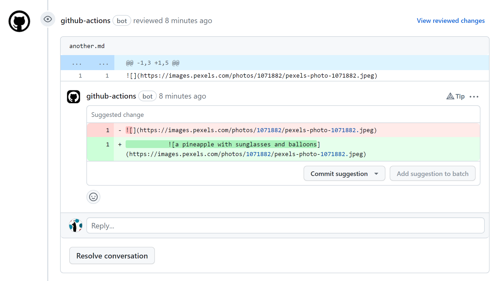

# Markdown Alt Text Suggester
A GitHub Action that finds missing markdown image inline alt texts and makes a suggestion for better accesibility

## Usage
Create a `.yml` file to your `.github/workflows/altsuggester.yml` and copy the following code
```
# This is a basic workflow to help you get started with Actions
name: MD Alt Suggester

# Controls when the workflow will run
on:
  # Triggers the workflow on push or pull request events but only for the "main" branch
  pull_request:
    branches: [ "main" ]

  # Allows you to run this workflow manually from the Actions tab
  workflow_dispatch:

# A workflow run is made up of one or more jobs that can run sequentially or in parallel
jobs:
  # This workflow contains a single job called "build"
  build:
    # The type of runner that the job will run on
    runs-on: ubuntu-latest

    # Steps represent a sequence of tasks that will be executed as part of the job
    steps:
      # Checks-out your repository under $GITHUB_WORKSPACE, so your job can access it
      - uses: actions/checkout@v3

      - name: Call MD Alt Text Suggester
        uses: juliannecc/md-alt-text@v1.0.1
        with:
          lang: en
          ENDPOINT_URL: ${{ secrets.ENDPOINT_URL }}
          AZURE_KEY: ${{ secrets.AZURE_KEY }}
          owner: ${{ github.repository_owner }}
          repo: ${{ github.event.repository.name }}
          token: ${{ secrets.GITHUB_TOKEN }}
          pull_number: ${{ github.event.number }}
          commit_id: ${{ github.event.pull_request.head.sha }}
          branch: ${{ github.head_ref }}
```
## Configuration
#### For `ENDPOINT_URL` and `AZURE_KEY`:
Make sure to set action secrets for `ENDPOINT_URL` and `AZURE_KEY`. To obtain the values for these, please check out [Image Analysis API](https://learn.microsoft.com/en-us/azure/cognitive-services/computer-vision/how-to/call-analyze-image?tabs=rest).

## Output


## Notes
The default language supported by the action is English due to the [API](https://learn.microsoft.com/en-us/azure/cognitive-services/computer-vision/how-to/call-analyze-image?tabs=rest) used (which only currently supports English). However, you may choose to use Verion 3.2 of the API to get the description of the images. 

#### Using Image Analysis API 3.2
Edit line `114` of `index.js`
Change 
```
        const response = await axios.post( `${ENDPOINT_URL}computervision/imageanalysis:analyze?api-version=2023-02-01-preview&features=caption&language=${lang}`, 

```
To
```
        const response = await axios.post( `${ENDPOINT_URL}/computervision/imageanalysis:analyze?api-version=2023-02-01-preview&features=Description&language=${lang}`, 


```

Version 3.2 supports the following languages
| Values | Language            |
|--------|---------------------|
| en     | English             |
| es     | Spanish             |
| ja     | Japanese            |
| pt     | Portuguese-Portugal |
| zh     | Chinese Simplified  |
